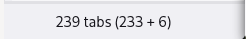

# tst-tab-count

This Firefox addon, a helper addon to the TreeStyleTabs addon, displays the total count of tabs in the "new tab" button:



Install it [from the releases page](https://github.com/rixx/tst-tab-count/releases)!

### Developer

```
web-ext build --overwrite-dest
```

Go to `about:debugging` and load the addon from the `web-ext-artifacts` directory.

### Publish

1. Increment the version in `manifest.json`
2. Commit and tag the release
3. ``web-ext build --overwrite-dest``
4. Upload the zip file to the [Firefox Addon Developer Hub](https://addons.mozilla.org/en-US/developers/addon/tst-tab-count/versions/submit/)
5. Download the signed xpi file and upload it to the [GitHub release](https://github.com/rixx/tst-tab-count/releases)
